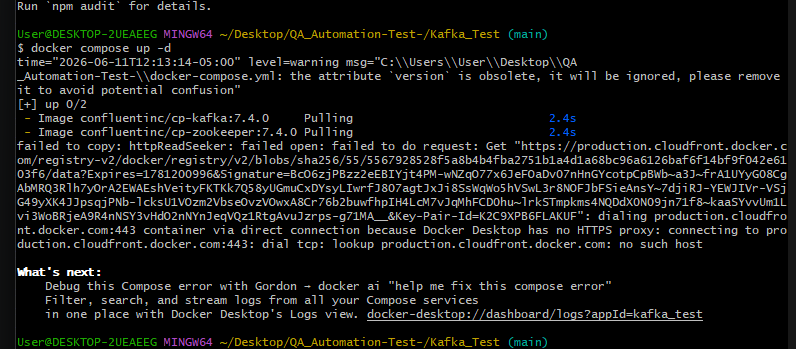
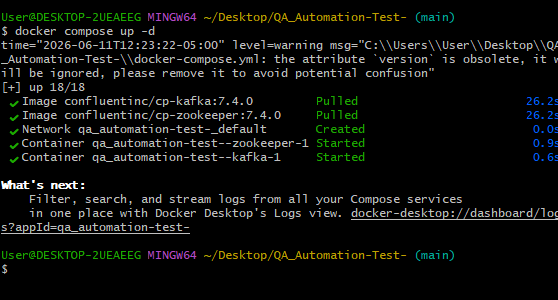

Jose Sebastian Monsalve Niño— QA ENGINEER 

**BITÁCORA DE USO DE AGENTES IA**

Durante la elaboración de esta prueba técnica se emplearon 2 agentes de inteligencia artificial. Gemini y Open IA Chat GPT, esto con fin de contrastar las respuestas brindadas por los agentes y de esta manera seleccionar el camino más adecuado para la solución del mismo

**Promt 1.** Estoy realizando una prueba técnica de QA Automation.

Te adjunto el PDF con los requisitos.

Estoy considerando estas aplicaciones:

- Wikipedia Mobile APP
- Sauce Labs My Demo App

Analiza cada una en profundidad y crea una matriz comparativa evaluando:

- Cobertura de requisitos
- Dificultad de automatización
- Calidad de la arquitectura que podría demostrar
- Casos de prueba posibles
- Riesgo de bloqueos técnicos
- Tiempo estimado

la IA genero una comparacion de las dos applicaciones gracias a eso pude identificar que el usar My demo App seria lo mas adecuado debido a su robustes multiples ventanas.

----------------------------------------------------------------------------------------------------------------------------------------------

Durante el proceso de levantamiento de arquitectura tuve problemas con la compatibilidad de Emulador que levanta y el reconocimiento en la lista de dispositivos ADB, por lo que tuve que recurrir a su asesoria.

**Promt 2.** He creado el proyecto QA_Movile_test con la app MyDEMO APP al crear el dispositivo pixel 7 pro con la ultima version de andorid no me aparece en el ADB list Devices.

la IA me orientó en la revision de la version del SDK seleccionado y su compatibilidad con los elementos que habia instalado por lo que recomendó usar un pixel 7 normal y android 14.

----------------------------------------------------------------------------------------------------------------------------------------------

ya durante la etapa de desarrollo tuve problemas al usar Appium inspector para mapear los selectores de la aplicacion por lo que;

**Promt 3.** Estoy configurando appium inspector conforme a los datos del host del dispositivo pero este aun no me permite generar conexion para poder mapearla aplacion, hay otra forma de obtener estos selectores?.

La IA me orientó en como generar archivos XML de cada pantalla de la apliacion

adb shell uiautomator dump
adb shell ls /sdcard/window_dump.xml
adb pull /sdcard/window_dump.xml C:\Users\User\Desktop\QA_Movile_test\

con fin de identificar los selecctores correspondientes y desbloquearme, gracias a eso pude avanzar con el desarrollo de la actividad.

----------------------------------------------------------------------------------------------------------------------------------------------

por ultimo me oriento a como se puede emplear kafka para el objetivo final de la prueba me ayudó a realizar el ultimo punto sobre kafka siendo una herramineta que nunca he usado.

como por ejemplo:

**Promt 4.** Estoy el docker compose para ejecutar kafka pero al momento de ejecutar el comando docker compose -up me genera este error:

gracias a ello pude identificar que docker no podia descargar la imagen de kafka por problemas del DNS.
